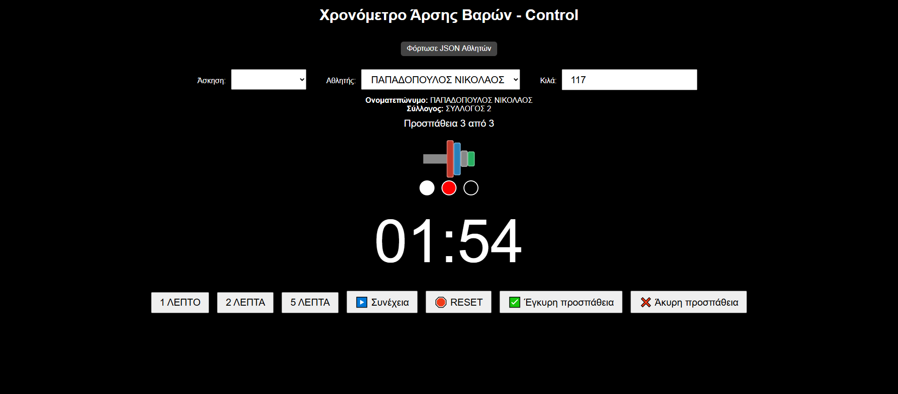
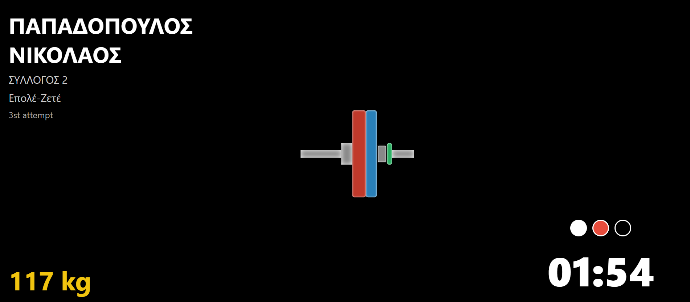
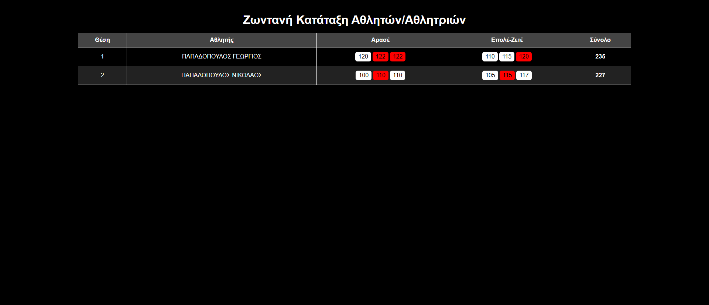

# serrlift-weightlifting-competition-app - EN
Live Weightlifting Competition System (Offline Web App) – Flask, HTML/JS

Personal project developed for use in official weightlifting competitions in Greece, enabling live tracking and athlete management during events.
<ul><li>A complete control and display system built to function entirely offline via a local router network.</li>
<li>Python backend using Flask + Flask-SocketIO, managing local JSON data for athletes and clubs. Communication is handled via WebSockets (socket.io) with four custom-built HTML/JavaScript clients.</li>  
<li>Control Clients (Men/Women): Select athletes, assign weights, track lift attempts (up to 3 per movement), manage countdown timer with audio alerts, and display dynamic barbell weight graph.</li>
<li>Screen Client: Public display for audience and organizers with live event data.</li>
<li>Results Client: Tracks successful/failed attempts with color-coded indicators and automatically updates athlete rankings.</li></ul>
<b>Technologies:</b> Python, Flask, HTML, JavaScript, Socket.IO, JSON  
<b>Architecture:</b> Fully offline setup via local router – all devices communicate through IP-based access in the browser.
  
<b>* Language Note:</b> All button labels and input fields in the screenshots are in Greek, as the app was designed for use in national events held in Greece.

# serrlift-weightlifting-competition-app -EL
Live Πληροφοριακό Σύστημα Αγώνων Άρσης Βαρών (Offline Web App) - Flask, HTML/JS

Προσωπικό project για χρήση σε αγώνες άρσης βαρών με live παρακολούθηση και διαχείριση αθλητών
<ul><li>Σχεδίαση και ανάπτυξη ολοκληρωμένου συστήματος ελέγχου και παρουσίασης σε αγώνες, χωρίς ανάγκη σύνδεσης στο διαδίκτυο (τοπικό δίκτυο μέσω router).</li>
<li>Python backend με Flask + Flask-SocketIO, που διαχειρίζεται τοπικά δεδομένα JSON για αθλητές και συλλόγους και επικοινωνεί μέσω WebSockets (socket.io) με τέσσερις HTML/JavaScript clients</li>
<li>Control clients: διαχείριση προσπαθειών αθλητών, επιλογή κιλών, χρονόμετρο με ηχητικές ειδοποιήσεις και δυναμικό γράφημα με τα βάρη</li>
<li>Screen client: προβολή όλων των δεδομένων σε δημόσια οθόνη για κοινό και διοργανωτές</li>
<li>Results client: καταγραφή προσπαθειών (έγκυρες/άκυρες με χρωματική επισήμανση) και αυτόματη ενημέρωση κατάταξης</li></ul>
<b>Τεχνολογίες:</b> Python, Flask, HTML, JavaScript, Socket.IO, JSON  
<b>Αρχιτεκτονική:</b> Τοπικό δίκτυο μέσω router (offline setup) – οι clients επικοινωνούν μέσω IP μέσω browser

### Control Panel (Men/Women)

### Screen View

### Results View

